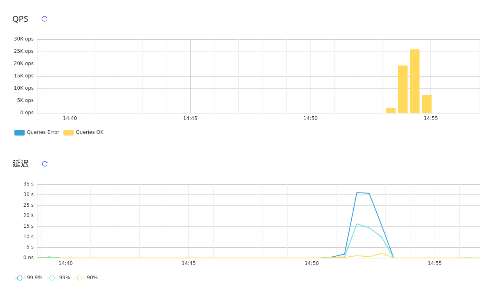

# TiDB 学习：对 TiDB 进行基准测试

通过 sysbench, go-ycsb, go-tpc 等工具对 TiDB 进行基准测试，熟悉 TiDB 性能分析方法以及相关工具的使用。

__由于计算资源缺乏，实验采用单机部署集群，
此测试以熟悉 TiDB 性能分析相关工具的使用为目的，
测试结果可能与正常场景有较大出入，无任何参考意义__


## 测试环境

- 系统：`Kernel: x86_64 Linux 5.4.0-42-generic`
- CPU: `AMD Ryzen 7 3700X 8-Core @ 16x 3.6GHz`
- 内存: `32106MiB`
- 磁盘: `KINGSTON SA400S37480G [480 GB]`

## 集群部署

根据相关文档，整理 tiup 配置 `topo.yaml` 并部署：
```
tiup cluster deploy tidb-cluster01 v4.0.4 ./topo.yaml --user root -p
tiup cluster start tidb-cluster01
```
其中包含：

- 1 个 TiDB 实例
- 1 个 pd 实例
- 3 个 TiKV 实例
- 1 个 prometheus 实例
- 1 个 grafana 实例

TiKV 配置：
```
readpool.storage.use-unified-pool: false
readpool.coprocessor.use-unified-pool: true
```

## 通过 sysbench 进行测试

sysbench 配置如下：
```
mysql-host=127.0.0.1
mysql-port=4000
mysql-user=root
mysql-db=test
time=60
threads=8
report-interval=10
db-driver=mysql
```
这里采用 `oltp_point_select` 进行测试:
```
sysbench --config-file=sysbench.cfg oltp_point_select --tables=32 --table-size=10000 prepare
sysbench --config-file=sysbench.cfg oltp_point_select --tables=32 --table-size=10000 run    
Running the test with following options:
Number of threads: 8
... 省略部分输出 ...

[ 10s ] thds: 8 tps: 28245.70 qps: 28245.70 (r/w/o: 28245.70/0.00/0.00) lat (ms,95%): 0.39 err/s: 0.00 reconn/s: 0.00
[ 20s ] thds: 8 tps: 28086.23 qps: 28086.23 (r/w/o: 28086.23/0.00/0.00) lat (ms,95%): 0.39 err/s: 0.00 reconn/s: 0.00
[ 30s ] thds: 8 tps: 27203.13 qps: 27203.13 (r/w/o: 27203.13/0.00/0.00) lat (ms,95%): 0.42 err/s: 0.00 reconn/s: 0.00
[ 40s ] thds: 8 tps: 28077.95 qps: 28077.95 (r/w/o: 28077.95/0.00/0.00) lat (ms,95%): 0.41 err/s: 0.00 reconn/s: 0.00
[ 50s ] thds: 8 tps: 28182.52 qps: 28182.52 (r/w/o: 28182.52/0.00/0.00) lat (ms,95%): 0.40 err/s: 0.00 reconn/s: 0.00
[ 60s ] thds: 8 tps: 28994.43 qps: 28994.43 (r/w/o: 28994.43/0.00/0.00) lat (ms,95%): 0.38 err/s: 0.00 reconn/s: 0.00
SQL statistics:
    queries performed:
        read:                            1687934
        write:                           0
        other:                           0
        total:                           1687934
    transactions:                        1687934 (28130.17 per sec.)
    queries:                             1687934 (28130.17 per sec.)
    ignored errors:                      0      (0.00 per sec.)
    reconnects:                          0      (0.00 per sec.)

General statistics:
    total time:                          60.0035s
    total number of events:              1687934

Latency (ms):
         min:                                  0.11
         avg:                                  0.28
         max:                                141.23
         95th percentile:                      0.40
         sum:                             478712.71

Threads fairness:
    events (avg/stddev):           210991.7500/121.63
    execution time (avg/stddev):   59.8391/0.00
```
sysbench 输出了测试结果，从 TiDB dashboard 和 grafana 可以看到更加直观的结果以及内部各项指标。

TiDB dashboard 上的 QPS 与延迟：


Grafana 上的 TiKV cluster 与 TiKV gRPC QPS：


## Go-ycsb 的使用

这里尝试使用 workloada 进行测试:
```
❯ ./bin/go-ycsb load mysql -P workloads/workloada -p recordcount=1000000 --threads 64 -p mysql.host=172.16.189.174 -p mysql.port=4000
❯ ./bin/go-ycsb run mysql -P workloads/workloada -p operationcount=1000000 --threads 64 -p mysql.host=172.16.189.174 -p mysql.port=4000
... 省略部分输出 ...
READ   - Takes(s): 9.9, Count: 1598, OPS: 161.7, Avg(us): 105638, Min(us): 7434, Max(us): 330218, 99th(us): 222000, 99.9th(us): 274000, 99.99th(us): 331000
UPDATE - Takes(s): 9.5, Count: 1575, OPS: 165.1, Avg(us): 290866, Min(us): 66728, Max(us): 1177648, 99th(us): 644000, 99.9th(us): 1062000, 99.99th(us): 1178000
READ   - Takes(s): 19.9, Count: 3253, OPS: 163.6, Avg(us): 119915, Min(us): 6820, Max(us): 494185, 99th(us): 281000, 99.9th(us): 339000, 99.99th(us): 495000
UPDATE - Takes(s): 19.5, Count: 3196, OPS: 163.6, Avg(us): 272921, Min(us): 49651, Max(us): 1177648, 99th(us): 644000, 99.9th(us): 1057000, 99.99th(us): 1178000
READ   - Takes(s): 29.9, Count: 4802, OPS: 160.7, Avg(us): 115150, Min(us): 6820, Max(us): 494185, 99th(us): 258000, 99.9th(us): 339000, 99.99th(us): 495000
UPDATE - Takes(s): 29.5, Count: 4844, OPS: 164.0, Avg(us): 279166, Min(us): 49651, Max(us): 1474889, 99th(us): 1344000, 99.9th(us): 1467000, 99.99th(us): 1475000
READ   - Takes(s): 39.9, Count: 6590, OPS: 165.2, Avg(us): 114157, Min(us): 6820, Max(us): 494185, 99th(us): 248000, 99.9th(us): 336000, 99.99th(us): 495000
UPDATE - Takes(s): 39.5, Count: 6664, OPS: 168.6, Avg(us): 269132, Min(us): 49651, Max(us): 1474889, 99th(us): 1144000, 99.9th(us): 1455000, 99.99th(us): 1475000
^C
Got signal [interrupt] to exit.
Run finished, takes 42.924548171s
```
TiDB dashboard 上的 QPS 与延迟：


Grafana 上的 TiKV cluster 与 TiKV gRPC QPS：


## TPC-C 测试，并利用 TiDB dashboard 分析性能

```
./bin/go-tpc tpcc --warehouses=8 prepare -T 8
... 省略部分输出 ...
./bin/go-tpc tpcc --warehouses=8 run -T 8 --time 20m
[Current] DELIVERY - Takes(s): 7.9, Count: 30, TPM: 228.4, Sum(ms): 11124, Avg(ms): 370, 90th(ms): 1000, 99th(ms): 1000, 99.9th(ms): 1000
[Current] NEW_ORDER - Takes(s): 8.4, Count: 336, TPM: 2413.9, Sum(ms): 37619, Avg(ms): 111, 90th(ms): 128, 99th(ms): 2000, 99.9th(ms): 2000
[Current] ORDER_STATUS - Takes(s): 7.7, Count: 23, TPM: 179.2, Sum(ms): 157, Avg(ms): 6, 90th(ms): 12, 99th(ms): 16, 99.9th(ms): 16
[Current] PAYMENT - Takes(s): 8.5, Count: 285, TPM: 2016.9, Sum(ms): 28671, Avg(ms): 100, 90th(ms): 160, 99th(ms): 2000, 99.9th(ms): 2000
[Current] STOCK_LEVEL - Takes(s): 8.0, Count: 36, TPM: 271.7, Sum(ms): 784, Avg(ms): 21, 90th(ms): 48, 99th(ms): 128, 99.9th(ms): 128
[Current] DELIVERY - Takes(s): 9.7, Count: 41, TPM: 252.3, Sum(ms): 11798, Avg(ms): 287, 90th(ms): 512, 99th(ms): 512, 99.9th(ms): 512
[Current] NEW_ORDER - Takes(s): 10.0, Count: 433, TPM: 2606.7, Sum(ms): 35932, Avg(ms): 82, 90th(ms): 128, 99th(ms): 192, 99.9th(ms): 512
[Current] ORDER_STATUS - Takes(s): 9.7, Count: 46, TPM: 283.8, Sum(ms): 225, Avg(ms): 4, 90th(ms): 8, 99th(ms): 12, 99.9th(ms): 12
[Current] PAYMENT - Takes(s): 10.0, Count: 434, TPM: 2607.3, Sum(ms): 31326, Avg(ms): 72, 90th(ms): 128, 99th(ms): 192, 99.9th(ms): 256
[Current] STOCK_LEVEL - Takes(s): 9.9, Count: 44, TPM: 267.5, Sum(ms): 500, Avg(ms): 11, 90th(ms): 20, 99th(ms): 24, 99.9th(ms): 24
[Current] DELIVERY - Takes(s): 10.0, Count: 44, TPM: 264.1, Sum(ms): 12962, Avg(ms): 294, 90th(ms): 512, 99th(ms): 1000, 99.9th(ms): 1000
[Current] NEW_ORDER - Takes(s): 10.0, Count: 364, TPM: 2186.9, Sum(ms): 32915, Avg(ms): 90, 90th(ms): 128, 99th(ms): 512, 99.9th(ms): 1000
[Current] ORDER_STATUS - Takes(s): 9.9, Count: 38, TPM: 229.6, Sum(ms): 212, Avg(ms): 5, 90th(ms): 8, 99th(ms): 20, 99.9th(ms): 20
[Current] PAYMENT - Takes(s): 10.0, Count: 347, TPM: 2086.0, Sum(ms): 28665, Avg(ms): 82, 90th(ms): 160, 99th(ms): 1000, 99.9th(ms): 1000
[Current] STOCK_LEVEL - Takes(s): 9.9, Count: 32, TPM: 194.5, Sum(ms): 281, Avg(ms): 8, 90th(ms): 12, 99th(ms): 16, 99.9th(ms): 16
[Current] NEW_ORDER - Takes(s): 9.5, Count: 22, TPM: 138.8, Sum(ms): 35667, Avg(ms): 1621, 90th(ms): 4000, 99th(ms): 8000, 99.9th(ms): 8000
[Current] ORDER_STATUS - Takes(s): 3.7, Count: 3, TPM: 48.1, Sum(ms): 998, Avg(ms): 332, 90th(ms): 1000, 99th(ms): 1000, 99.9th(ms): 1000
[Current] PAYMENT - Takes(s): 9.8, Count: 18, TPM: 109.7, Sum(ms): 24740, Avg(ms): 1374, 90th(ms): 4000, 99th(ms): 8000, 99.9th(ms): 8000
[Current] STOCK_LEVEL - Takes(s): 5.4, Count: 2, TPM: 22.2, Sum(ms): 19, Avg(ms): 9, 90th(ms): 12, 99th(ms): 12, 99.9th(ms): 12
[Current] NEW_ORDER - Takes(s): 10.0, Count: 25, TPM: 150.4, Sum(ms): 47691, Avg(ms): 1907, 90th(ms): 8000, 99th(ms): 8000, 99.9th(ms): 8000
[Current] PAYMENT - Takes(s): 10.0, Count: 23, TPM: 138.3, Sum(ms): 45553, Avg(ms): 1980, 90th(ms): 8000, 99th(ms): 8000, 99.9th(ms): 8000
```
这里指定测试时间为 20 分钟， 测试开始后，观察 dashboard 与 grafana:

TiDB dashboard 上的 QPS 与延迟：


Grafana 上的 TiKV cluster 与 TiKV gRPC QPS：


同时利用 dashboard `高级调试` 中的 `实例性能分析` 对 TiDB 实例进行 120 秒的采样。
根据采样结果，发现 TiDB CPU 耗时大致可分为三类：

- TiDB 本身逻辑
- 系统调用
- Go 运行时

由于不熟悉源码，这里尝试通过耗时情况分析大致性能优化方向。

### 系统调用的优化

系统调用是不可或缺的。因此只能通过流程优化来减少系统调用的次数。
TiDB 的系统调用主要是网络 IO，Go runtime 与 gRPC 在这方面几乎优化到了极致，
暂认为系统调用方向的优化空间不大。

## TiDB 本身逻辑和 Go 运行时

根据 Lesson2 ，采样结果生成的图中，颜色越深表示该函数及其子函数耗时越多。
由此，`CompileExecutePreparedStmt` 和 `runStmt` 耗时最多。


然而，图中显示 `0 of 5.78s (15.02%)` 和 `0.02s (0.052%) of 7.72s (20.06%)`，
可见本身耗时分别为 0s 和 0.02s。因此不能仅看颜色与总耗时。

除去子函数、方法及运行时外，耗时较多的函数、方法有：

- `*batchCommandsClient.batchRecvLoop`
- `*RegionRequestSender.SendReqCtx`
- `*clientStream.SendMsg`

如下图：


根据其类型、方法名，推测是 TiDB 将 SQL 模型转换为 KV 模型后与 TiKV API 的交互部分，
因此认为在执行计划的生成与优化、与 TiKV 交互等方面有较大的性能提升潜力。
